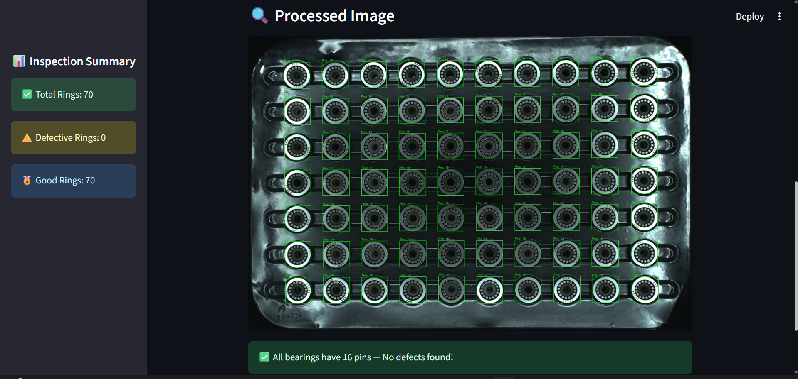
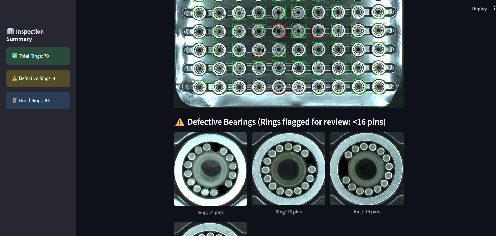

<div align="center">

# ⚙️ Automated Bearing Quality Inspection System

### 🔍 AI-driven pipeline for detecting defective bearings based on pin count analysis

</div>

---

## Dataset
Download dataset from:
[https://drive.google.com/Bearing_data](https://drive.google.com/file/d/1xx6LGH8ae98OmQMsoG1tYLMYL9at_fou/view?usp=sharing)

## 📘 Overview

This repository presents an **Automated Bearing Quality Inspection System** that leverages **deep learning and computer vision** to inspect bearing images automatically.  
The system detects **bearings** and their **internal pins**, counts them, and classifies each bearing as either **Good** or **Defective** based on pin count thresholds.

- Bearings with **16 pins** → ✅ *Good Bearing*  
- Bearings with **less than 16 pins** → ❌ *Defective Bearing*

---

## 🧠 System Workflow

The pipeline follows a **two-stage detection process** using YOLOv8 models:

1. **Stage 1 – Bearing Detection:**  
   - A custom-trained YOLO model identifies and localizes individual bearings from the tray image.
   - Each detected bearing is cropped for further analysis.

2. **Stage 2 – Pin Detection:**  
   - Another YOLO model detects and counts pins inside each cropped bearing.
   - The number of detected pins determines whether the bearing is good or defective.

3. **Rule-based Classification:**  
   - If a bearing has **exactly 16 pins → Good**  
   - If a bearing has **fewer than 16 pins → Defective**

4. **Streamlit Dashboard:**  
   - Displays bounding boxes, pin counts, and results interactively.
   - Highlights defective bearings in **red** for review.
   - Summarizes total, good, and defective ring counts.

---

## 🧩 Features

- 🧠 Dual YOLO model setup for multi-stage detection  
- 📦 Automatic cropping and pin counting per bearing  
- ⚙️ Rule-based logic for classification  
- 💻 Streamlit dashboard for visualization  
- 🧾 JSON and TXT file export for each detection  
- 📈 Real-time quality validation and monitoring  

---

## 🧰 Tech Stack

| Component | Technology Used |
|------------|----------------|
| Deep Learning Framework | **YOLOv8 (Ultralytics)** |
| Programming Language | **Python** |
| Image Processing | **OpenCV, NumPy** |
| Web App Interface | **Streamlit** |
| Visualization | **Matplotlib, PIL** |
| Model Management | **PyTorch** |
| Output Format | **JSON, TXT** |

---

## 🧪 Example Output

Below are examples of the system’s output —  
showing detected bearings, pin counts, and defective rings highlighted for review:

<div align="center">

### 🖼️ Output 1 – Bearing Detection


### 🖼️ Output 2 – Pin Counting & Defective Ring Highlighting


</div>

---

## 📊 Pipeline Summary

| Stage | Description | Model | Output |
|--------|--------------|--------|--------|
| 1️⃣ Bearing Detection | Detects individual bearings from tray image | YOLOv8 | Cropped bearing images |
| 2️⃣ Pin Detection | Detects pins within each bearing | YOLOv8 | Pin count per bearing |
| 3️⃣ Classification | Classifies as “Good” or “Defective” | Rule-based | Bearing label |
| 4️⃣ Visualization | Displays results with bounding boxes | Streamlit | Interactive dashboard |

---

## 🏁 Results

- ✅ **Accurate defect identification** based on pin count  
- 🚀 **Automated visual inspection** reduces manual checking effort  
- 📊 **Real-time dashboard** for instant monitoring  
- 📂 **Exportable results** for record-keeping and quality reports  

---

## ⚡ How to Run

```bash
# 1️⃣ Clone this repository
git clone https://github.com/yourusername/bearing-quality-inspection.git
cd bearing-quality-inspection

# 3️⃣ Run the Streamlit application
streamlit run app.py
